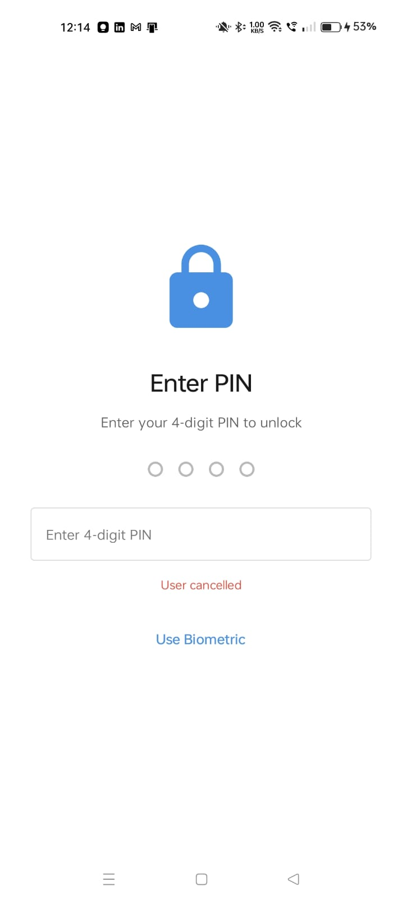
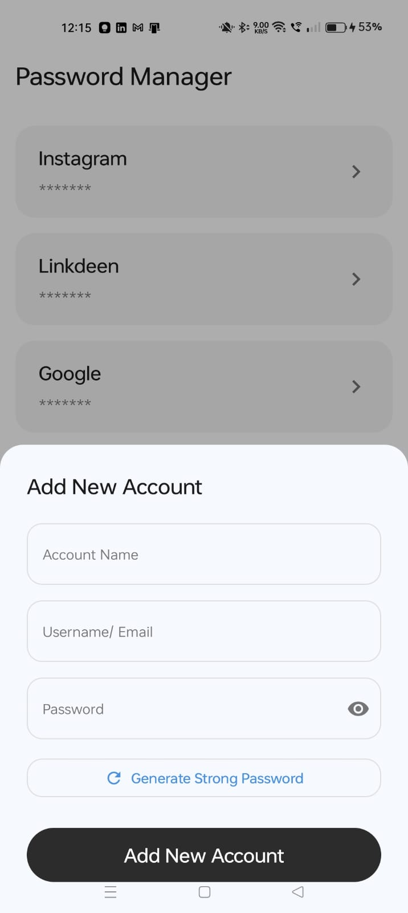
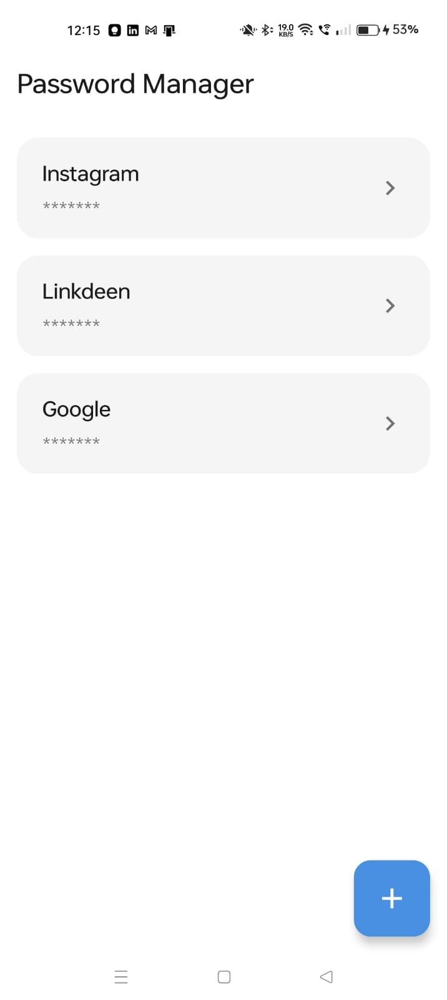
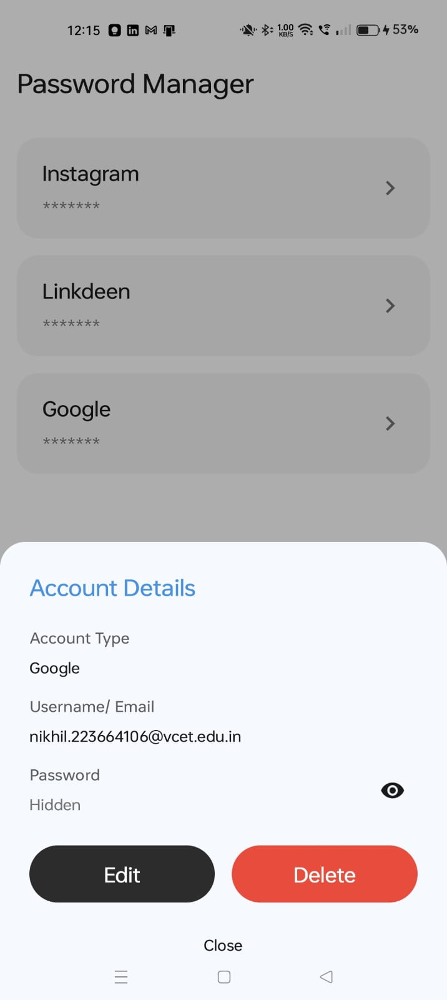
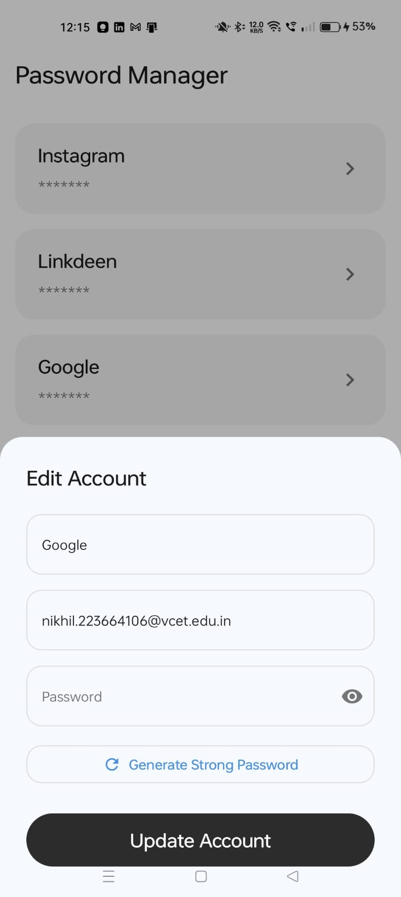

# 🔐 PassAssist - Secure Password Manager

A modern, secure password manager for Android built with Jetpack Compose. Store, manage, and protect your passwords with enterprise-grade security.

## ✨ Features

### 🔒 Security
- **Biometric Authentication** - Fingerprint/Face ID unlock
- **PIN Protection** - 4-digit PIN with encrypted storage
- **Background Lock** - Auto-lock when app goes to background
- **Recent Apps Protection** - Hides content in multitasking view
- **Screenshot Prevention** - Blocks screenshots for security
- **AES-256 Encryption** - All passwords encrypted at rest

### 🎯 Password Management
- **Add/Edit/Delete** passwords with account details
- **Password Strength Meter** - Real-time strength analysis with visual feedback
- **Password Generator** - Generate strong, random passwords (8-32 chars)
- **Secure Storage** - Android Keystore + Room database
- **Password Visibility Toggle** - Show/hide passwords on demand

## 📱 Screenshots







## 🚀 Quick Start

### Requirements
- Android 7.0+ (API 24+)
- Android Studio Ladybug or later
- Kotlin 1.9.24+

### Installation
```bash
git clone <repository-url>
cd Pass_assist
./gradlew build
./gradlew installDebug
```

## 🛠️ Tech Stack

- **UI**: Jetpack Compose, Material Design 3
- **Architecture**: MVVM with ViewModel & LiveData
- **Database**: Room Persistence Library
- **Security**: Android Keystore, EncryptedSharedPreferences
- **Biometric**: androidx.biometric
- **Language**: Kotlin

## 🔐 Security Features Details

- **Biometric Auth**: Supports fingerprint and face recognition with PIN fallback
- **PIN Management**: SHA-256 hashed PINs, 5-attempt limit with 30s lockout
- **Auto-Lock**: Re-authentication required when returning from background
- **Content Protection**: FLAG_SECURE prevents screenshots and Recent Apps preview
- **Encryption**: AES-256-GCM with secure key management

## 📦 Dependencies

- Jetpack Compose BOM
- Room Database
- Biometric Library
- Security Crypto (EncryptedSharedPreferences)
- Lifecycle Components

## 📁 Project Structure

```
app/src/main/java/com/masterpushers/pass_assist/
├── data/          # Room entities, DAOs, Repository
├── ui/            # Compose screens, ViewModels
├── utils/         # Encryption, Biometric, Password utilities
└── theme/         # Material Design theme
```

## 🎨 UI Features

- Modern Material Design 3 interface
- Smooth animations and transitions
- Rounded square FAB with elegant design
- Real-time password strength visualization
- Interactive password generator with customization

## 📝 Usage

1. **First Launch**: Create a 4-digit PIN
2. **Unlock**: Use biometric or PIN to access passwords
3. **Add Password**: Tap + button → Enter details → Generate or enter password
4. **View/Edit**: Tap any password card to view or edit
5. **Security**: App auto-locks when minimized

## 🔄 Background Authentication

The app automatically requires authentication when:
- Returning from background (Home button, app switch)
- App resumes after being paused
- Every time you open the app

## 📸 Screenshots

Screenshots are located in the `screenshots/` directory:
- `screenshot1.jpg` - Authentication screen
- `screenshot2.jpg` - Add new account screen
- `screenshot3.jpg` - Home screen
- `screenshot4.jpg` - Account details screen
- `screenshot5.jpg` - Update account screen

## 📄 License

MIT License - See LICENSE file for details

## 👨‍💻 Development

Built with ❤️ using Jetpack Compose and modern Android development practices.

---

**Note**: This app requires biometric hardware or PIN setup. All passwords are encrypted and never stored in plain text.
